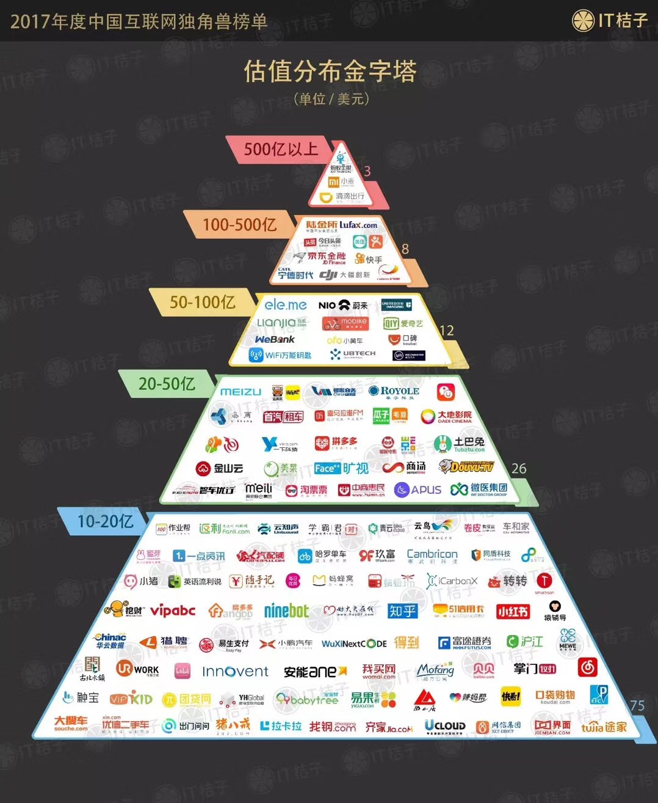

## 2018KEYWORD:空杯，进化，落地。

危险总是存在的，但恐惧只是一种选择。

To make compicated things simplified.（复杂问题简单化。） —— Jeff Dean

人生就像一场大火，我们每个人唯一可以做的就是从这场大火中多抢救一些东西出来。—— Bill Gates

大家游的速度其实不相上下，但是有的人更会减少阻力。

时间换钱，钱换时间，剥削永恒。

程序员薪资组成：公司职级，技术壁垒，面试结果，稀缺程度，Offer竞争。

温水煮青蛙。

---

**本地使用或者启动：**

```
gitbook serve

// 导出pdf
gitbook pdf .
gitbook pdf

// 导出mobi
gitbook mobi .
gitbook mobi
```

如果报错：

```
InstallRequiredError: "ebook-convert" is not installed.
Install it from Calibre: https://calibre-ebook.com
```

解决：

**需要安装：**

[https://download.calibre-ebook.com/3.31.0/calibre-3.31.0.dmg](https://download.calibre-ebook.com/3.31.0/calibre-3.31.0.dmg)

```
ln -s /Applications/calibre.app/Contents/MacOS/ebook-convert /usr/local/bin

```

----


