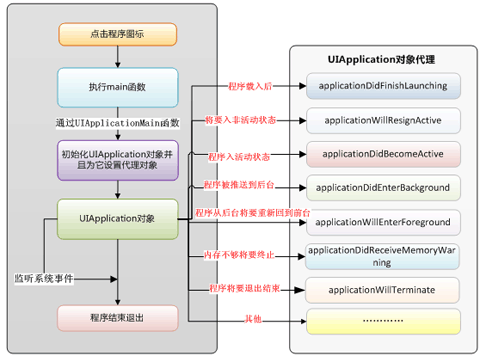

iOS基础篇

========

# block和 weak修饰符的区别？

* __block不管是ARC还是MRC模式下都可以使用，可以修饰对象，也可以修饰基本数据类型
* __weak 只能在ARC模式下使用，只能修饰对象（NSString），不能修饰基本数据类型
* block修饰的对象可以在block中被重新赋值， weak修饰的对象不可以

# 什么情况使用weak关键字，相比assign有什么不同？
* 首先明白什么情况使用weak关键字？
 * 在ARC中,在有可能出现循环引用的时候,往往要通过让其中一端使用weak来解决,比如:delegate代理属性，代理属性也可使用assign
 * 自身已经对它进行一次强引用,没有必要再强引用一次,此时也会使用weak,自定义IBOutlet控件属性一般也使用weak；当然，也可以使用strong，但是建议使用weak

* weak 和assign的不同点
 * weak策略在属性所指的对象遭到摧毁时，系统会将weak修饰的属性对象的指针指向nil，在OC给nil发消息是不会有什么问题的；如果使用assign策略在属性所指的对象遭到摧毁时，属性对象指针还指向原来的对象，由于对象已经被销毁，这时候就产生了野指针，如果这时候在给此对象发送消息，很容造成程序奔溃
 * assigin 可以用于修饰非OC对象,而weak必须用于OC对象

引申点：weak 修饰的对象释放逻辑。

# 堆和栈的区别

* 从管理方式来讲
 *  对于栈来讲，是由编译器自动管理，无需我们手工控制；
 * 对于堆来说，释放工作由程序员控制，容易产生内存泄露(memory leak)
* 从申请大小大小方面讲
 * 栈空间比较小
 * 堆控件比较大
* 从数据存储方面来讲
 * 栈空间中一般存储基本类型，对象的地址
 * 堆空间一般存放对象本身，block的copy等

引申点：内存区的知识点（堆，栈，常量区，静态区）

# 风格纠错题
 
 * 修改后的代码
 
 ```bash
 typedef NS_ENUM(NSInteger, CYLSex)
{
  CYLSexMan,
  CYLSexWoman
};

 @interface CYLUser : NSObject<NSCopying>

 @property (nonatomic, copy, readonly) NSString *name;
 @property (nonatomic, assign, readonly) NSUInteger age;
 @property (nonatomic, assign, readwrite) CYLSex sex;

 - (instancetype)initWithName:(NSString *)name age:(NSUInteger)age sex:(CYLSex)sex;
 - (instancetype)initWithName:(NSString *)name age:(NSUInteger)age;
 + (instancetype)userWithName:(NSString *)name age:(NSUInteger)age sex:(CYLSex)sex;

 @end
 ```
 
# Objective-C使用什么机制管理对象内存？
 * MRC 手动引用计数
 * ARC 自动引用计数,现在通常ARC
 * 通过retainCount 的机制来决定对象是否需要释放。每次runloop 的时候，都会检查对象的retainCount，如果retainCount 为0，说明该对象没有地方需要继续使用了，可以释放掉了

引申点：runloop知识点，或者autoreleasepool知识点

# ARC通过什么方式帮助开发者管理内存？或者“ARC什么时机做了什么事情？”
 * 通过编译器在编译的时候,插入类似内存管理的代码

# ARC下还会存在内存泄露吗？
1. 循环引用会导致内存泄露
2. Objective-C对象与CoreFoundation对象进行桥接的时候如果管理不当也会造成内存泄露
3. CoreFoundation中的对象不受ARC管理，需要开发者手动释放

引申点：请举例 CoreFoundation 的几个类

# @property 的本质是什么？@dynamic 与@synthesize 区别

* @property其实就是在编译阶段由编译器自动帮我们生成ivar成员变量，getter方法，setter方法
* @dynamic 手动设置setter和getter方法。如果不设置，就会crash
* @synthesize 编译自动设置setter和getter方法

# @property后面可以有哪些修饰符？
* 基本数据类型，默认关键字为 ： 
 * atomic
 * readwrite
 * assign 
* 对应对象类型，默认关键字为: 
 * atomic
 * readwrite
 * strong
* 方法名--
 * -getter= 
 * setter=
* 其他关键词
   * 非原子操作 nonatomic
   * 读写权限readonly, readwrite
   * 内存管理 assign, strong, weak, unsafe_unretained, copy
   * 方法名 getter,setter
   * 不常用的nonnull, null_resettable,nullable

引申点： atomic与nonatomic区别，什么时候用atomic。

# 使用atomic一定是线程安全的吗？
* 不是，atomic的本意是指属性的存取方法是线程安全的，并不保证整个对象是线程安全的。
* 举例：声明一个NSMutableArray的原子属性stuff，此时self.stuff和self.stuff = othersulf都是线程安全的。但是，使用[self.stuff objectAtIndex:index]就不是线程安全的，需要用互斥锁来保证线程安全性

# 怎么用copy 关键字？
* NSString、NSArray、NSDictionary等等经常使用copy关键字，是因为他们有对应的可变类型：NSMutableString、NSMutableArray、NSMutableDictionary，为确保对象中的属性值不会无意间变动，应该在设置新属性值时拷贝一份，保护其封装性
* block也经常使用copy关键字
 * block 使用copy 是从MRC 遗留下来的“传统”,在MRC 中,方法内部的block 是在栈区的,使用copy 可以把它放到堆区.
 * 在ARC中写不写都行：对于block使用copy还是strong效果是一样的，但是建议写上copy，因为这样显示告知调用者“编译器会自动对block进行了copy操作”

引申点：block的相关知识， copy内存的相关知识及使用场景。

# copy知识点
* 浅复制(shallow copy)：在浅复制操作时，对于被复制对象的每一层都是指针复制。
* 深复制(one-level-deepcopy)：在深复制操作时，对于被复制对象，至少有一层是深复制。
* 完全复制(real-deepcopy)：在完全复制操作时，对于被复制对象的每一层都是对象复制。

* 非集合类对象的copy与mutableCopy

 * [不可变对象 copy] // 浅复制
 * [不可变对象 mutableCopy] //深复制
 * [可变对象 copy] //深复制
 * [可变对象 mutableCopy] //深复制
* 集合类对象的copy与mutableCopy

 * [不可变对象 copy] // 浅复制
 * [不可变对象 mutableCopy] //单层深复制
 * [可变对象 copy] //单层深复制
 * [可变对象 mutableCopy] //单层深复制
* 这里需要注意的是集合对象的内容复制仅限于对象本身，对象元素仍然是指针复制

引申点：给可变或者不可变数组，字典，等，问内容是否两个内容是否一致

# 这个写法会出什么问题： @property (copy) NSMutableArray *array;

* 因为copy策略拷贝出来的是一个不可变对象，然而却把它当成可变对象使用，很容易造成程序奔溃
* 这里还有一个问题，该属性使用了同步锁，会在创建时生成一些额外的代码用于帮助编写多线程程序，这会带来性能问题，通过声明nonatomic可以节省这些虽然很小但是不必要额外开销，在iOS开发中应该使用nonatomic替代atomic

# 如何让自定义类可以用copy 修饰符？如何重写带copy 关键字的setter？或者“如何使自己的对象具有copy属性”
* 若想令自己所写的对象具有拷贝功能，则需实现NSCopying协议。如果自定义的对象分为可变版本与不可变版本，那么就要同时实现NSCopyiog与NSMutableCopying协议，不过一般没什么必要，实现NSCopying协议就够了

```
 // 实现不可变版本拷贝
 - (id)copyWithZone:(NSZone *)zone;

 // 实现可变版本拷贝
- (id)mutableCopyWithZone:(NSZone *)zone;

// 重写带 copy 关键字的 setter
- (void)setName:(NSString *)name
{
    _name = [name copy];
}
```
引申点： 如何使自己的对象具有归档功能？

# +(void)load; +(void)initialize;有什么用处？
* +(void)load;
 * 当类对象被引入项目时, runtime 会向每一个类对象发送load 消息
 * load方法会在每一个类甚至分类被引入时仅调用一次,调用的顺序：父类优先于子类,子类优先于分类
 * 由于load 方法会在类被import 时调用一次,而这时往往是改变类的行为的最佳时机，在这里可以使用例如method swizlling 来修改原有的方法
 * load方法不会被类自动继承
* +(void)initialize;
 * 也是在第一次使用这个类的时候会调用这个方法，也就是说initialize也是懒加载

* 总结：
  * 在Objective-C中，runtime会自动调用每个类的这两个方法
  * +load会在类初始加载时调用
  * +initialize会在第一次调用类的类方法或实例方法之前被调用
  * 这两个方法是可选的，且只有在实现了它们时才会被调用
  * 两者的共同点：两个方法都只会被调用一次

# Foundation对象与Core Foundation对象有什么区别
* Foundation框架是使用OC实现的，Core Foundation是使用C实现的
* Foundation对象和Core Foundation对象间的转换：俗称桥接

* ARC环境桥接关键字：

```
 // 可用于Foundation对象 和 Core Foundation对象间的转换
 __bridge

 // 用于Foundation对象 转成 Core Foundation对象
 __bridge_retained

 // Core Foundation对象 转成 Foundation对象
 __bridge_transfer

```
Foundation对象转成Core Foundation对象

 * 使用__bridge桥接

 * 如果使用__bridge桥接,它仅仅是将strOC的地址给了strC,并没有转移对象的所有权，也就是说,如果使用__bridge桥接,那么如果strOC释放了,strC也不能用了
 * 注意:在ARC条件下,如果是使用__bridge桥接,那么strC 可以不用主动释放,因为ARC会自动管理strOC和strC
 
```
NSString *strOC1 = [NSString stringWithFormat:@"abcdefg"];

CFStringRef strC1 = (__bridge CFStringRef)strOC1;

NSLog(@"%@ %@", strOC1, strC1);
```
* 使用__bridge_retained桥接

 * 如果使用__bridge_retained桥接,它会将对象的所有权转移给strC,也就是说,即便strOC被释放了, strC也可以使用
 * 注意:在ARC条件下,如果是使用__bridge_retained桥接,那么strC 必须自己手动释放,因为桥接的时候已经将对象的所有权转移给了strC,而C语言的东西不是不归ARC管理的

```
NSString *strOC2 = [NSString stringWithFormat:@"abcdefg"];

//    CFStringRef strC2 = (__bridge_retained CFStringRef)strOC2;

CFStringRef strC2 = CFBridgingRetain(strOC2);// 这一句, 

就等同于上一句

CFRelease(strC2);

Core Foundation对象转成Foundation对象
```

* 使用__bridge桥接

 * 如果使用__bridge桥接,它仅仅是将strC的地址给了strOC,并没有转移对象的所有权
 * 也就是说如果使用__bridge桥接,那么如果strC释放了,strOC也不能用了
 * 
```
CFStringRef strC3 = CFStringCreateWithCString(CFAllocatorGetDefault(), "12345678", kCFStringEncodingASCII);
NSString *strOC3 = (__bridge NSString *)strC3;
CFRelease(strC3);
```

* 使用__bridge_transfer桥接

 * 如果使用__bridge_transfer桥接,它会将对象的所有权转移给strOC,也就是说,即便strC被释放了, strOC也可以使用
 * 如果使用__bridge_transfer桥接, 他会自动释放strC, 也就是以后我们不用手动释放strC

```
CFStringRef strC4 = CFStringCreateWithCString(CFAllocatorGetDefault(), "12345678", kCFStringEncodingASCII);
//     NSString *strOC = (__bridge_transfer NSString *)strC;
NSString *strOC4 = CFBridgingRelease(strC4); // 这一句, 
```
就等同于上一句
MRC环境：直接强转


```
-(void)bridgeInMRC
{
  // 将Foundation对象转换为Core Foundation对象，直接强制类型转换即可
  NSString *strOC1 = [NSString stringWithFormat:@"xxxxxx"];
  CFStringRef strC1 = (CFStringRef)strOC1;
  NSLog(@"%@ %@", strOC1, strC1);
  [strOC1 release];
  CFRelease(strC1);

  // 将Core Foundation对象转换为Foundation对象，直接强制类型转换即可
  CFStringRef strC2 = CFStringCreateWithCString(CFAllocatorGetDefault(), "12345678", kCFStringEncodingASCII);
  NSString *strOC2 = (NSString *)strC2;
  NSLog(@"%@ %@", strOC2, strC2);
  [strOC2 release];
  CFRelease(strC2);
}
```

# addObserver:forKeyPath:options:context:各个参数的作用分别是什么，observer中需要实现哪个方法才能获得KVO回调？
```
// 注册要监听的对象
[self.person addObserver:self forKeyPath:@"name" options:NSKeyValueObservingOptionNew | NSKeyValueObservingOptionOld context:@"Person Name"];

// 当监控的某个属性的值改变了就会调用
- (void)observeValueForKeyPath:(NSString *)keyPath ofObject:(id)object change:(NSDictionary *)change context:(void *)context{

}


```

# NSCache优于NSDictionary的几点？
* 1.nscache 是可以自动释放内存的。 
* 2.nscache是线程安全的，我们可以在不同的线程中添加，删除和查询缓存中的对象。 
* 3.一个缓存对象不会拷贝key对象。

# 说一下AppDelegate的几个方法？从后台到前台调用了哪些方法？第一次启动调用了哪些方法？从前台到后台调用了哪些方法？



# 数据持久化的几个方案

* plist,存储字典，数组比较好用 
* preference：偏好设置，实质也是plist 
* NSKeyedArchiver：归档，可以存储对象 
* sqlite：数据库，经常使用第三方来操作，也就是fmdb 
* coreData:也是数据库储存，苹果官方的

# 程序性能的优化

1. 使用复用机制
2. 尽可能设置 View 为不透明
3. 避免臃肿的 XIB 文件
4. 不要阻塞主线程
5. 图片尺寸匹配 UIImageView
6. 选择合适的容器
7. 启用 GZIP 数据压缩
8. View 的复用和懒加载机制
9. 缓存
服务器的响应信息（response）。
图片。
计算值。比如：UITableView 的 row heights。
10. 关于图形绘制
11. 处理 Memory Warnings
	* 在 AppDelegate 中实现 - [AppDelegate applicationDidReceiveMemoryWarning:] 代理方法。
	* 在 UIViewController 中重载 didReceiveMemoryWarning 方法。
	* 监听 UIApplicationDidReceiveMemoryWarningNotification 通知。
12. 复用高开销的对象
13. 减少离屏渲染(设置圆角和阴影的时候可以选用绘制的方法)
14. 优化 UITableView
   * 通过正确的设置 reuseIdentifier 来重用 Cell。
   * 尽量减少不必要的透明 View。 
   * 尽量避免渐变效果、图片拉伸和离屏渲染。
   * 当不同的行的高度不一样时，尽量缓存它们的高度值。
   * 如果 Cell 展示的内容来自网络，确保用异步加载的方式来获取数据，并且缓存服务器的 response。
   * 使用 shadowPath 来设置阴影效果。
   * 尽量减少 subview 的数量，对于 subview 较多并且样式多变的   Cell，可以考虑用异步绘制或重写 drawRect。
   * 尽量优化 - [UITableView tableView:cellForRowAtIndexPath:] 方法中的处理逻辑，如果确实要做一些处理，可以考虑做一次，缓存结果。
   * 选择合适的数据结构来承载数据，不同的数据结构对不同操作的开销是存在差异的。
   * 对于 rowHeight、sectionFooterHeight、sectionHeaderHeight 尽量使用常量。
15. 选择合适的数据存储方式
	* 在 iOS 中可以用来进行数据持有化的方案包括：
	* NSUserDefaults。只适合用来存小数据。
	* XML、JSON、Plist 等文件。JSON 和 XML 文件的差异在「选择正确的数据格式」已经说过了。
	* 使用 NSCoding 来存档。NSCoding 同样是对文件进行读写，所以它也会面临必须加载整个文件才能继续的问题。
	* 使用 SQLite 数据库。可以配合 FMDB 使用。数据的相对文件来说还是好处很多的，比如可以按需取数据、不用暴力查找等等。
	* 使用 CoreData。也是数据库技术，跟 SQLite 的性能差异比较小。但是 CoreData 是一个对象图谱模型，显得更面向对象；SQLite 就是常规的 DBMS。
16. 减少应用启动时间
	* 快速启动应用对于用户来说可以留下很好的印象。尤其是第一次使用时。
	* 保证应用快速启动的指导原则：
	* 尽量将启动过程中的处理分拆成各个异步处理流，比如：网络请求、数据库访问、数据解析等等。
	* 避免臃肿的 XIB 文件，因为它们会在你的主线程中进行加载。重申：Storyboard 没这个问题，放心使用。
	* 注意：在测试程序启动性能的时候，最好用与 Xcode 断开连接的设备进行测试。因为 watchdog 在使用 Xcode 进行调试的时候是不会启动的。
17. 使用 Autorelease Pool （内存释放池）
18. imageNamed 和 imageWithContentsOfFile
