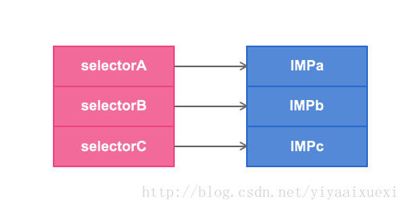
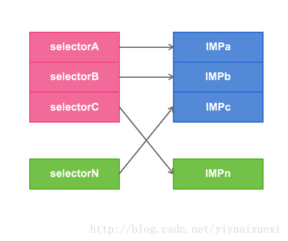

iOS面试-原理篇

=====

#Block 相关知识

# 使用block时什么情况会发生引用循环，如何解决？

# 在block内如何修改block外部变量？
对外部变量进行 __block 修饰

# 使用系统的某些block api（如UIView的block版本写动画时），是否也考虑循环引用问题？

* 系统的某些block api中，UIView的block版本写动画时不需要考虑，但也有一些api 需要考虑

以下这些使用方式不会引起循环引用的问题

```
[UIView animateWithDuration:duration animations:^
{ [self.superview layoutIfNeeded]; }];

[[NSOperationQueue mainQueue] addOperationWithBlock:^
{ self.someProperty = xyz; }];

[[NSNotificationCenter defaultCenter] addObserverForName:@"someNotification"
            object:nil
             queue:[NSOperationQueue mainQueue]
        usingBlock:^(NSNotification * notification)
        { self.someProperty = xyz; }];

```
* 但如果方法中的一些参数是成员变量，那么可以造成循环引用，如GCD 、NSNotificationCenter调用就要小心一点，比如GCD 内部如果引用了self，而且GCD 的参数是成员变量，则要考虑到循环引用，举例如下：
 * GCD
     * 分析：self-->_operationsQueue-->block-->self形成闭环，就造成了循环引用。修改为
     
		 ```
		 __weak __typeof__(self) weakSelf = self;
		dispatch_group_async(_operationsGroup, _operationsQueue, ^
		{
		[weakSelf doSomething];
		[weakSelf doSomethingElse];
		} );
		 ```
   * NSNotificationCenter

		 * 分析：self-->_observer-->block-->self形成闭环，就造成了循环引用
		 
			```
			__weak __typeof__(self) weakSelf = self;
			_observer = [[NSNotificationCenter defaultCenter]
			addObserverForName:@"testKey"
			object:nil
			queue:nil
			usingBlock:^(NSNotification *note){
			    [weakSelf dismissModalViewControllerAnimated:YES];
			}];
			```

-----

# GCD原理
* GCD的工作原理是：让程序平行排队的特定任务，根据可用的处理资源，安排他们在任何可用的处理器核心上执行任务。

* 一个任务可以是一个函数(function)或者是一个block。 GCD的底层依然是用线程实现，不过这样可以让程序员不用关注实现的细节。

* GCD中的FIFO队列称为dispatch queue，它可以保证先进来的任务先得到执行。


# GCD的队列（dispatch_queue_t）分哪两种类型？背后的线程模型是什么样的？
* 串行队列
* 并行队列
* dispatch_global_queue();是全局并发队列
* dispatch_main_queue();是一种特殊串行队列
* 背后的线程模型：自定义队列dispatch_queue_t queue;可以自定义是并行：DISPATCH_QUEUE_CONCURRENT或者串行DISPATCH_QUEUE_SERIAL

# 如何用GCD同步若干个异步调用？（如根据若干个url异步加载多张图片，然后在都下载完成后合成一张整图）

* 必须是并发队列才起作用
* 需求分析
 * 首先，分别异步执行2个耗时的操作
 * 其次，等2个异步操作都执行完毕后，再回到主线程执行一些操作
* 使用队列组实现上面的需求

```
// 创建队列组
dispatch_group_t group =  dispatch_group_create();

// 获取全局并发队列
dispatch_queue_t queue = dispatch_get_global_queue(DISPATCH_QUEUE_PRIORITY_DEFAULT, 0);

// 往队列组中添加耗时操作
dispatch_group_async(group, queue, ^{
    // 执行耗时的异步操作1
});

// 往队列组中添加耗时操作
dispatch_group_async(group, queue, ^{
    // 执行耗时的异步操作2
});

// 当并发队列组中的任务执行完毕后才会执行这里的代码
dispatch_group_notify(group, queue, ^{
    // 如果这里还有基于上面两个任务的结果继续执行一些代码，建议还是放到子线程中，等代码执行完毕后在回到主线程

    // 回到主线程
    dispatch_async(group, dispatch_get_main_queue(), ^{
        // 执行相关代码...
    });
});
```

# dispatch_barrier_async的作用是什么？
barrier(屏障)

* 函数定义

```
dispatch_barrier_async(dispatch_queue_t queue, dispatch_block_t block);
```

* 必须是并发队列，要是串行队列，这个函数就没啥意义了
* 注意：这个函数的第一个参数queue 不能是全局的并发队列
* 作用：在它前面的任务执行结束后它才执行，在它后面的任务等它执行完成后才会执

```
-(void)barrier
{
    dispatch_queue_t queue = dispatch_queue_create("12342234", DISPATCH_QUEUE_CONCURRENT);

    dispatch_async(queue, ^{
        NSLog(@"----1-----%@", [NSThread currentThread]);
    });
    dispatch_async(queue, ^{
        NSLog(@"----2-----%@", [NSThread currentThread]);
    });

    // 在它前面的任务执行结束后它才执行，在它后面的任务等它执行完成后才会执行
    dispatch_barrier_async(queue, ^{
        NSLog(@"----barrier-----%@", [NSThread currentThread]);
    });

    dispatch_async(queue, ^{
        NSLog(@"----3-----%@", [NSThread currentThread]);
    });
    dispatch_async(queue, ^{
        NSLog(@"----4-----%@", [NSThread currentThread]);
    });
}
```

# GCD的一些常用的函数？（group，barrier，信号量，线程同步）
* group:
    * 我们使用队列组来开辟线程时，队列组中的队列任务是并发，当所有的队列组中的所有任务完成时候，才可以调用队列组完成任务。

```
/**创建自己的队列*/
dispatch_queue_t dispatchQueue = dispatch_queue_create("ted.queue.next", DISPATCH_QUEUE_CONCURRENT);
/**创建一个队列组*/
dispatch_group_t dispatchGroup = dispatch_group_create();
/**将队列任务添加到队列组中*/
dispatch_group_async(dispatchGroup, dispatchQueue, ^(){
    NSLog(@"dispatch-1");
});
   /**将队列任务添加到队列组中*/
dispatch_group_async(dispatchGroup, dispatchQueue, ^(){
    NSLog(@"dspatch-2");
});
  /**队列组完成调用函数*/
dispatch_group_notify(dispatchGroup, dispatch_get_main_queue(), ^(){
    NSLog(@"end");
})
```

* barrier:
    * 表示栅栏，当在并发队列里面使用栅栏时候，栅栏之前的并发任务开始并发执行，执行完毕后，执行栅栏内的任务，等栅栏任务执行完毕后，再并发执行栅栏后的任务。

```
dispatch_queue_t concurrentQueue = dispatch_queue_create("my.concurrent.queue", DISPATCH_QUEUE_CONCURRENT);
dispatch_async(concurrentQueue, ^(){
    NSLog(@"dispatch-1");
});
dispatch_async(concurrentQueue, ^(){
    NSLog(@"dispatch-2");
});
dispatch_barrier_async(concurrentQueue, ^(){
    NSLog(@"dispatch-barrier"); 
});
dispatch_async(concurrentQueue, ^(){
    NSLog(@"dispatch-3");
});
dispatch_async(concurrentQueue, ^(){
    NSLog(@"dispatch-4");
});

```

* 信号量：

   * Semaphore是通过‘计数’的方式来标识线程是否是等待或继续执行的。信号量

```
dispatch_semaphore_create(int) // 创建一个信号，并初始化信号的计数大小
/* 等待信号，并且判断信号量，如果信号量计数大于等于你创建时候的信号量的计数，就可以通过，继续执行，并且将你传入的信号计数减1，
 * 如果传入的信号计数小于你创建的计数，就表示等待，等待信号计数的变化
 *  如果等待的时间超过你传入的时间，也会继续下面操作
 *   第一个参数：semaphore 表示信号量
 *   第二个参数：表示等待的时间
 *    返回int 如果传入的信号计数大于等于你创建信号的计数时候，返回0.  反之，返回的不等于0
 */
 int result = dispatch_semaphore_wait(dispatch_semaphore_t  semaphore,time outTime);// 表示等待，也是阻碍线程  
// 表示将信号技术+1
dispatch_semaphore_signl(dispatch_semaphore_t semaphore);


- (void)semaphoreDemo1 {
    dispatch_semaphore_t semaphore = dispatch_semaphore_create(10);
    for (int i = 0; i < 100; i++) {
        //// 由于是异步执行的，所以每次循环Block里面的dispatch_semaphore_signal根本还没有执行就会执行dispatch_semaphore_wait，从而semaphore-1.当循环10此后，semaphore等于0，则会阻塞线程，直到执行了Block的dispatch_semaphore_signal 才会继续执行
        NSLog(@"i %zd",i);
        /// 执行十次之后阻塞当前线程
        dispatch_semaphore_wait(semaphore, DISPATCH_TIME_FOREVER);
    }
}

- (void)semaphoreDemo2 {
    dispatch_semaphore_t goOnSemaphore = dispatch_semaphore_create(0);
    NSLog(@"ready");
    [self network:^(id result) {
        NSLog(@"net return:%@",result);
        dispatch_semaphore_signal(goOnSemaphore);
    }];
    dispatch_semaphore_wait(goOnSemaphore, DISPATCH_TIME_FOREVER);
    NSLog(@"go on");
}
- (void)network:(void(^)(id result))block {
    sleep(2.0);
    block(@(arc4random_uniform(2)));
}

```


# 以下代码运行结果如何？

```
- (void)viewDidLoad
{
    [super viewDidLoad];
    NSLog(@"1");
    dispatch_sync(dispatch_get_main_queue(), ^{
        NSLog(@"2");
    });
    NSLog(@"3");
}
```
* 答案：主线程死锁


------

#iOS 程序 main 函数之前发生了什么
* 1.加载动态链接库(dyld)
* 2.加载图片资源符号(ImageLoader)
* 3.runtime+load

--------

# 一个Objective-C对象如何进行内存布局？（考虑有父类的情况）
* 所有父类的成员变量和自己的成员变量都会存放在该对象所对应的存储空间中
* 父类的方法和自己的方法都会缓存在类对象的方法缓存中，类方法是缓存在元类对象中
* 每一个对象内部都有一个isa指针,指向他的类对象,类对象中存放着本对象的如下信息
 * 对象方法列表
 * 成员变量的列表
 * 属性列表
* 每个Objective-C 对象都有相同的结构，如下图所示

 Objective-C 对象的结构图 |
 --- |
 ISA指针|
 根类(NSObject)的实例变量|
 倒数第二层父类的实例变量|
 ... |
 父类的实例变量 |
类的实例变量 |

* 根类对象就是NSObject，它的super class指针指向nil
* 类对象既然称为对象，那它也是一个实例。类对象中也有一个isa指针指向它的元类(meta class)，即类对象是元类的实例。元类内部存放的是类方法列表，根元类的isa指针指向自己，superclass指针指向NSObject类

  
# 一个objc对象的isa的指针指向什么？有什么作用？
* 每一个对象内部都有一个isa指针，这个指针是指向它的真实类型
* 根据这个指针就能知道将来调用哪个类的方法

# objc中的类方法和实例方法有什么本质区别和联系

* 类方法：
 * 类方法是属于类对象的
 * 类方法只能通过类对象调用
 * 类方法中的self是类对象
 * 类方法可以调用其他的类方法
 * 类方法中不能访问成员变量
 * 类方法中不能直接调用对象方法
 * 类方法是存储在元类对象的方法缓存中
* 实例方法：
 * 实例方法是属于实例对象的
 * 实例方法只能通过实例对象调用
 * 实例方法中的self是实例对象
 * 实例方法中可以访问成员变量
 * 实例方法中直接调用实例方法
 * 实例方法中可以调用类方法(通过类名)
 * 实例方法是存放在类对象的方法缓存中

----------


# 是否可以把比较耗时的操作放在NSNotificationCenter中
* 首先必须明确通知在哪个线程中发出，那么处理接受到通知的方法也在这个线程中调用
* 如果在异步线程发的通知，那么可以执行比较耗时的操作；
* 如果在主线程发的通知，那么就不可以执行比较耗时的操作

# NSNotificationCenter原理
* 消息通知的原理简单来说就是有一个通知中心，它有一些属性，来存放那些注册了的观察者的信息，然后当通过通知中心发送通知的时候会去根据name，object去查找符合条件的观察者，将通知发送给它们。


-----------------

#runtime 如何实现weak 属性

* 那么runtime如何实现weak变量的自动置nil？
* runtime对注册的类，会进行布局，会将 weak 对象放入一个 hash 表中。
* 用 weak 指向的对象内存地址作为 key，当此对象的引用计数为0的时候会调用对象的 dealloc 方法，
* 假设 weak 指向的对象内存地址是a，那么就会以a为key，在这个 weak hash表中搜索，找到所有以a为key的 weak 对象，从而设置为 nil。

# weak属性需要在dealloc中置nil么

* 在ARC环境无论是强指针还是弱指针都无需在dealloc 设置为nil ， ARC 会自动帮我们处理
* 即便是编译器不帮我们做这些，weak也不需要在dealloc中置nil
* 在属性所指的对象遭到摧毁时，属性值也会清空

# runtime怎么添加属性、方法等
* ivar表示成员变量
* class_addIvar
* class_addMethod
* class_addProperty
* class_addProtocol
* class_replaceProperty

# runtime如何通过selector找到对应的IMP地址？（分别考虑类方法和实例方法）
* 每一个类对象中都一个对象方法列表（对象方法缓存）
* 类方法列表是存放在类对象中isa指针指向的元类对象中（类方法缓存）
* 方法列表中每个方法结构体中记录着方法的名称, 方法实现,以及参数类型，其实selector本质就是方法名称,通过这个方法名称就可以在方法列表中找到对应的方法实现.
* 当我们发送一个消息给一个NSObject对象时，这条消息会在对象的类对象方法列表里查找
* 当我们发送一个消息给一个类时，这条消息会在类的Meta Class对象的方法列表里查找

# 使用runtime Associate方法关联的对象，需要在主对象dealloc的时候释放么？
* 无论在MRC下还是ARC下均不需要
* 被关联的对象在生命周期内要比对象本身释放的晚很多，它们会在被NSObject -dealloc调用的object_dispose()方法中释放
* 补充：对象的内存销毁时间表，分四个步骤

```
1.调用 -release ：引用计数变为零
 * 对象正在被销毁，生命周期即将结束.
 * 不能再有新的 __weak 弱引用，否则将指向 nil.
 * 调用 [self dealloc]
2. 父类调用 -dealloc
 * 继承关系中最直接继承的父类再调用 -dealloc
 * 如果是 MRC 代码 则会手动释放实例变量们（iVars）
 * 继承关系中每一层的父类 都再调用 -dealloc
3. NSObject 调 -dealloc
 * 只做一件事：调用 Objective-C runtime 中的 object_dispose() 方法
4. 调用 object_dispose()
 * 为 C++ 的实例变量们（iVars）调用 destructors
 * 为 ARC 状态下的 实例变量们（iVars） 调用 -release
 * 解除所有使用 runtime Associate方法关联的对象
 * 解除所有 __weak 引用
 * 调用 free()
```

# _objc_msgForward函数是做什么的？直接调用它将会发生什么？

* _objc_msgForward是IMP类型，用于消息转发的：当向一个对象发送一条消息，但它并没有实现的时候，_objc_msgForward会尝试做消息转发
* 直接调用_objc_msgForward是非常危险的事，这是把双刃刀，如果用不好会直接导致程序Crash，但是如果用得好，能做很多非常酷的事
* [JSPatch](https://github.com/bang590/JSPatch)就是直接调用_objc_msgForward来实现其核心功能的
* [详细解说](https://github.com/ChenYilong/iOSInterviewQuestions/blob/master/01%E3%80%8A%E6%8B%9B%E8%81%98%E4%B8%80%E4%B8%AA%E9%9D%A0%E8%B0%B1%E7%9A%84iOS%E3%80%8B%E9%9D%A2%E8%AF%95%E9%A2%98%E5%8F%82%E8%80%83%E7%AD%94%E6%A1%88/%E3%80%8A%E6%8B%9B%E8%81%98%E4%B8%80%E4%B8%AA%E9%9D%A0%E8%B0%B1%E7%9A%84iOS%E3%80%8B%E9%9D%A2%E8%AF%95%E9%A2%98%E5%8F%82%E8%80%83%E7%AD%94%E6%A1%88%EF%BC%88%E4%B8%8B%EF%BC%89.md)参见这里的第一个问题解答

# 能否向编译后得到的类中增加实例变量？能否向运行时创建的类中添加实例变量？为什么？
* 不能,  向编译后得到的类中增加实例变量；
* 能,  向运行时创建的类中添加实例变量；
* 分析如下：
  * 因为编译后的类已经注册在runtime中，类结构体中的objc_ivar_list实例变量的链表和instance_size实例变量的内存大小已经确定，同时runtime会调用class_setIvarLayout或class_setWeakIvarLayout来处理strong weak引用，所以不能向存在的类中添加实例变量
 * 运行时创建的类是可以添加实例变量，调用class_addIvar函数，但是得在调用objc_allocateClassPair 之后，objc_registerClassPair 之前，原因同上。

 # 调用方法的过程（runtime）
*  Objective-C是动态语言，每个方法在运行时会被动态转为消息发送，即：objc_msgSend(receiver, selector)，整个过程介绍如下：
 * objc在向一个对象发送消息时，runtime库会根据对象的isa指针找到该对象实际所属的类
 * 然后在该类中的方法列表以及其父类方法列表中寻找方法运行
 * 如果，在最顶层的父类（一般也就NSObject）中依然找不到相应的方法时，程序在运行时会挂掉并抛出异常unrecognized selector sent to XXX
 * 但是在这之前，objc的运行时会给出三次拯救程序崩溃的机会，这三次拯救程序奔溃的说明见问题《什么时候会报unrecognized selector的异常》中的说明
* 补充说明：Runtime 铸就了Objective-C 是动态语言的特性，使得C语言具备了面向对象的特性，在程序运行期创建，检查，修改类、对象及其对应的方法，这些操作都可以使用runtime中的对应方法实现。

引申点：三次拯救程序奔溃是什么？

# 什么是method swizzling（俗称黑魔法）

* 简单说就是进行方法交换
* 在Objective-C中调用一个方法，其实是向一个对象发送消息，查找消息的唯一依据是selector的名字。利用Objective-C的动态特性，可以实现在运行时偷换selector对应的方法实现，达到给方法挂钩的目的
* 每个类都有一个方法列表，存放着方法的名字和方法实现的映射关系，selector的本质其实就是方法名，IMP有点类似函数指针，指向具体的Method实现，通过selector就可以找到对应的IMP 


* 交换方法的几种实现方式
 * 利用method_exchangeImplementations 交换两个方法的实现
 * 利用class_replaceMethod 替换方法的实现
 * 利用method_setImplementation 来直接设置某个方法的IMP 


# 什么时候会报unrecognized selector的异常？

* 当调用该对象上某个方法,而该对象上没有实现这个方法的时候， 可以通过“消息转发”进行解决，如果还是不行就会报unrecognized selector异常
* objc是动态语言，每个方法在运行时会被动态转为消息发送，即：objc_msgSend(receiver, selector)，整个过程介绍如下：

 * objc在向一个对象发送消息时，runtime库会根据对象的isa指针找到该对象实际所属的类
 * 然后在该类中的方法列表以及其父类方法列表中寻找方法运行
 * 如果，在最顶层的父类中依然找不到相应的方法时，程序在运行时会挂掉并抛出异常unrecognized selector sent to XXX 。但是在这之前，objc的运行时会给出三次拯救程序崩溃的机会
* 三次拯救程序崩溃的机会

 * Method resolution
     * objc运行时会调用+resolveInstanceMethod:或者 +resolveClassMethod:，让你有机会提供一个函数实现。
     * 如果你添加了函数并返回YES，那运行时系统就会重新启动一次消息发送的过程
     * 如果resolve 方法返回NO ，运行时就会移到下一步，消息转发
 * Fast forwarding
     * 如果目标对象实现了-forwardingTargetForSelector:，Runtime这时就会调用这个方法，给你把这个消息转发给其他对象的机会
     * 只要这个方法返回的不是nil和self，整个消息发送的过程就会被重启，当然发送的对象会变成你返回的那个对象。
     * 否则，就会继续Normal Fowarding。
     * 这里叫Fast，只是为了区别下一步的转发机制。因为这一步不会创建任何新的对象，但Normal forwarding转发会创建一个NSInvocation对象，相对Normal forwarding转发更快点，所以这里叫Fast forwarding
 * Normal forwarding
     * 这一步是Runtime最后一次给你挽救的机会。
     * 首先它会发送-methodSignatureForSelector:消息获得函数的参数和返回值类型。
     * 如果-methodSignatureForSelector:返回nil，Runtime则会发出-doesNotRecognizeSelector:消息，程序这时也就挂掉了。
     * 如果返回了一个函数签名，Runtime就会创建一个NSInvocation对象并发送-forwardInvocation:消息给目标对象


# 有没有用过运行时，用它都能做什么？
 * 交换方法，创建类，给新创建的类增加方法，改变isa指针
     * 交换方式：一般写在类的+(void)load方法里面
     
     ```
         Method originalM = class_getInstanceMethod([self class], @selector(originMethod));
    Method exchangeM = class_getInstanceMethod([self class], @selector(exChangeMethod));
    method_exchangeImplementations(originalM, exchangeM); 

     ```
     * 创建类：
     
     ```
	     /// 创建类
	- (void)creatClassMethod {
	
	    Class Person = objc_allocateClassPair([NSObject class], "Person", 0);
	    //添加属性
	    objc_property_attribute_t type = { "T", "@\"NSString\"" };
	    objc_property_attribute_t ownership = { "C", "" }; // C = copy
	    objc_property_attribute_t backingivar  = { "V", "_privateName" };
	    objc_property_attribute_t attrs[] = { type, ownership, backingivar };
	    class_addProperty(Person, "name", attrs, 3);
	    //添加方法
	    class_addMethod(Person, @selector(name), (IMP)nameGetter, "@@:");
	    class_addMethod(Person, @selector(setName:), (IMP)nameSetter, "v@:@");
	    //注册该类
	    objc_registerClassPair(Person);
	
	    //获取实例
	    id instance = [[Person alloc] init];
	    NSLog(@"%@", instance);
	    [instance setName:@"hxn"];
	    NSLog(@"%@", [instance name]);
	}
	//get方法
	NSString *nameGetter(id self, SEL _cmd) {
	    Ivar ivar = class_getInstanceVariable([self class], "_privateName");
	    return object_getIvar(self, ivar);
	}
	//set方法
	void nameSetter(id self, SEL _cmd, NSString *newName) {
	    Ivar ivar = class_getInstanceVariable([self class], "_privateName");
	    id oldName = object_getIvar(self, ivar);
	    if (oldName != newName) object_setIvar(self, ivar, [newName copy]);
	}
     ```
     * 添加方法
     
     ```
     /**参数一、类名参数
   二、SEL 添加的方法名字参数
    三、IMP指针 (IMP就是Implementation的缩写，它是指向一个方法实现的指针，每一个方法都有一个对应的IMP)
  参数四、其中types参数为"i@:@“，按顺序分别表示：具体类型可参照[官方文档](https://developer.apple.com/library/content/documentation/Cocoa/Conceptual/ObjCRuntimeGuide/Articles/ocrtTypeEncodings.html)i 返回值类型int，若是v则表示void@ 参数id(self): SEL(_cmd)@ id(str)
  V@:表示返回值是void 带有SEL参数 （An object (whether statically typed or typed id)）
  */
class_addMethod(Person, @selector(addMethodForMyClass:), (IMP)addMethodForMyClass, "V@:");
     ```
     * 添加实例变量
     * 
		```
		/**参数一、类名参数
  二、属性名称参数
  三、开辟字节长度参数
  四、对其方式参数
  五、参数类型 “@” 官方解释 An object (whether statically typed or typed id) （对象 静态类型或者id类型） 具体类型可参照[官方文档](https://developer.apple.com/library/content/documentation/Cocoa/Conceptual/ObjCRuntimeGuide/Articles/ocrtTypeEncodings.html)return: BOOL 是否添加成功
  */
BOOL isSuccess = class_addIvar(Person, "name", sizeof(NSString *), 0, "@");
isSuccess?NSLog(@"添加变量成功"):NSLog(@"添加变量失败");
		```

---------

# 什么是 Runloop？

* 从字面上讲就是运行循环。

* 它内部就是do-while循环，在这个循环内部不断地处理各种任务。

* 一个线程对应一个RunLoop，主线程的RunLoop默认已经启动，子线程的RunLoop得手动启动（调用run方法）

* RunLoop只能选择一个Mode启动，如果当前Mode中没有任何Source(Sources0、Sources1)、Timer，那么就直接退出RunLoop

* 基本的作用就是保持程序的持续运行，处理app中的各种事件。通过runloop，有事运行，没事就休息，可以节省cpu资源，提高程序性能。

 * Runloop对象

   * iOS中有2套API来访问和使用RunLoop
	* Foundation：NSRunLoop
	* Core Foundation：CFRunLoopRef
	* NSRunLoop和CFRunLoopRef都代表着RunLoop对象
	* NSRunLoop是基于CFRunLoopRef的一层OC包装，所以要了解RunLoop内部结构，需要多研究CFRunLoopRef层面的API。

# autorelease 对象在什么情况下会被释放？
* 分两种情况：手动干预释放和系统自动释放
* 手动干预释放就是指定autoreleasepool,当前作用域大括号结束就立即释放
* 系统自动去释放:不手动指定autoreleasepool,Autorelease对象会在当前的 runloop 迭代结束时释放
* kCFRunLoopEntry(1):第一次进入会自动创建一个autorelease
* kCFRunLoopBeforeWaiting(32):进入休眠状态前会自动销毁一个autorelease,然后重新创建一个新的autorelease
* kCFRunLoopExit(128):退出runloop时会自动销毁最后一个创建的autorelease

# 苹果是如何实现autoreleasepool的？

* autoreleasepool以一个队列数组的形式实现,主要通过下列三个函数完成.
 * objc_autoreleasepoolPush
 * objc_autoreleasepoolPop
 * objc_aurorelease
* 看函数名就可以知道，对autorelease分别执行push，和pop操作。销毁对象时执行release操作


# runloop和线程有什么关系？
* 每条线程都有唯一的一个RunLoop对象与之对应的
* 主线程的RunLoop是自动创建并启动
* 子线程的RunLoop需要手动创建
* 子线程的RunLoop创建步骤如下：


# 为什么 UIScrollView 的滚动会导致 NSTimer 失效？
* NSTimer对象是在 NSDefaultRunLoopMode下面调用消息的，但是当我们滑动scrollview的时候，NSDefaultRunLoopMode模式就自动切换到UITrackingRunLoopMode模式下面，却不可以继续响应NSTimer发送的消息。所以如果想在滑动scrollview的情况下面还调用NSTimer的消息，我们可以把NSRunloop的模式更改为NSRunLoopCommonModes

# NSTimer 准吗？怎么写一个准的timer
* 不准
* 原因：定时器被添加在主线程中，由于定时器在一个RunLoop中被检测一次，所以如果在这一次的RunLoop中做了耗时的操作，当前RunLoop持续的时间超过了定时器的间隔时间，那么下一次定时就被延后了。

* 利用 CADisplayLink
 * CADisplayLink是一个频率能达到屏幕刷新率的定时器类。iPhone屏幕刷新频率为60帧/秒，也就是说最小间隔可以达到1/60s。

* GCD定时器
 * 我们知道，RunLoop是dispatch_source_t实现的timer，所以理论上来说，GCD定时器的精度比NSTimer只高不低。
 
```
NSTimeInterval interval = 1.0;
_timer = dispatch_source_create(DISPATCH_SOURCE_TYPE_TIMER, 0, 0, dispatch_get_global_queue(DISPATCH_QUEUE_PRIORITY_DEFAULT, 0));
dispatch_source_set_timer(_timer, dispatch_walltime(NULL, 0), interval * NSEC_PER_SEC, 0);
dispatch_source_set_event_handler(_timer, ^{
    NSLog(@"GCD timer test");
});
dispatch_resume(_timer);

```


---------------------

# KVO内部实现原理
* KVO是基于runtime机制实现的

* 当某个类的属性对象第一次被观察时，系统就会在运行期动态地创建该类的一个派生类，在这个派生类中重写基类中任何被观察属性的setter方法。派生类在被重写的setter方法内实现真正的通知机制

* 如果原类为Person，那么生成的派生类名为NSKVONotifying_Person

* 每个类对象中都有一个isa指针指向当前类，当一个类对象的第一次被观察，那么系统会偷偷将isa指针指向动态生成的派生类，从而在给被监控属性赋值时执行的是派生类的setter方法

* 键值观察通知依赖于NSObject 的两个方法: willChangeValueForKey: 和didChangevlueForKey:；在一个被观察属性发生改变之前， willChangeValueForKey: 一定会被调用，这就会记录旧的值。而当改变发生后，didChangeValueForKey: 会被调用，继而observeValueForKey:ofObject:change:context: 也会被调用。

* 补充：KVO的这套实现机制中苹果还偷偷重写了class方法，让我们误认为还是使用的当前类，从而达到隐藏生成的派生类 


# 如何手动触发一个value的KVO
自动触发的场景：在注册KVO之前设置一个初始值，注册之后，设置一个不一样的值，就可以触发了
想知道如何手动触发，必须知道自动触发KVO 的原理，见上面的描述
手动触发演示

```
@property (nonatomic, strong) NSDate *now;

- (void)viewDidLoad
{
    [super viewDidLoad];

    // “手动触发self.now的KVO”，必写。
    [self willChangeValueForKey:@"now"];

    // “手动触发self.now的KVO”，必写。
    [self didChangeValueForKey:@"now"];
}
```

# 若一个类有实例变量NSString *_foo，调用setValue:forKey:时，是以foo还是_foo作为key？

* 都可以

# KVC的keyPath中的集合运算符如何使用？
* 必须用在集合对象上或普通对象的集合属性上
* 简单集合运算符有@avg， @count ， @max ， @min ，@sum
* 格式@"@sum.age" 或@"集合属性.@max.age"？？？

# KVC和KVO的keyPath一定是属性么？
* 可以是成员变量
