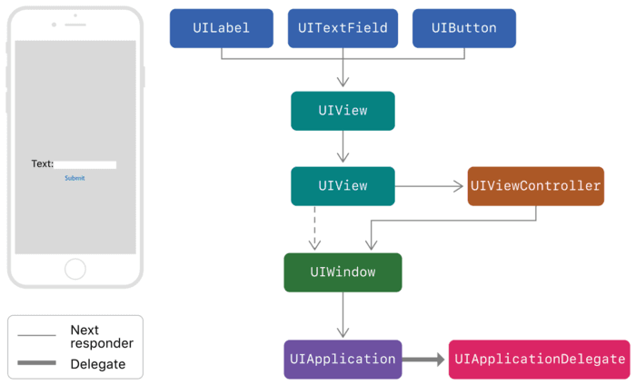

iOS面试-UI

=======

# 为什么更新UI要在主线程？

* 1.UIKit不是线程安全的，假如在两个线程中设置了同一张背景图片，很有可能就会由于背景图片被释放两次，使得程序崩溃。或者某一个线程中遍历找寻某个subView，然而在另一个线程中删除了该subView，那么就会造成错乱。
* 2.子线程中对所有其他ui更新都要等到该子线程生命周期结束才进行，而对响应用户点击的Button的UI更新则是及时的。

# iOS事件响应链

* 1、响应者链通常是由视图（UIView）构成的；
* 2、一个视图的下一个响应者是它视图控制器（UIViewController）（如果有的话），然后再转给它的父视图（Super View）；
* 3、视图控制器（如果有的话）的下一个响应者为其管理的视图的父视图；
* 4、单例的窗口（UIWindow）的内容视图将指向窗口本身作为它的下一个响应者
需要指出的是，Cocoa Touch应用不像Cocoa应用，它只有一个UIWindow对象，因此整个响应者链要简单一点；
* 5、单例的应用（UIApplication）是一个响应者链的终点，也可能到app delegate如果对象是UIResponder的实例并且不是响应链的一部分。它的下一个响应者指向nil，以结束整个循环。

# UITableview的优化方法

缓存高度，异步绘制，减少层级，hide，避免离屏渲染

